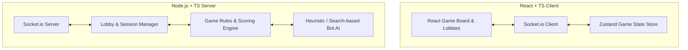

# Kingdoms Web App Architecture

Architecture design for a web-based version of Reiner Knizia's board game **Kingdoms** featuring React (TypeScript), Node.js WebSockets, and AI Bots for solo play.

---

## 1. System Overview

---

## 2. Component Design (Frontend)

*   **Lobby Screen:** Join or create games, choose opponent counts, add bots (easy/hard), and set player names.
*   **Game Board:** A responsive $5 \times 6$ grid with drag-and-drop or click-to-place interactions for tiles and castles.
*   **Player Control Panel:** Shows current player hand (available castles, gold, and secret tile).
*   **Game Log & Chat:** Real-time log of moves (e.g., *"Player 1 placed a Rank 3 Castle at Row 2, Column 3"*) and a lobby chat.
*   **Epoch Summary Overlay:** Displays scores, multiplier tallies, and rank-1 castle returns at the end of each epoch.

---

## 3. WebSocket Messages (Events)

| Event Name | Direction | Payload | Description |
| :--- | :--- | :--- | :--- |
| `create_game` | Client -> Server | `{ playerName: string, botCount: number }` | Creates a new game lobby. |
| `join_game` | Client -> Server | `{ gameId: string, playerName: string }` | Joins an existing game lobby. |
| `game_state` | Server -> Client | `GameState` (Complete state, hiding other players' secret tiles) | Emitted when state changes. |
| `place_castle` | Client -> Server | `{ castleRank: number, row: number, col: number }` | Places a castle on the grid. |
| `place_secret_tile` | Client -> Server | `{ row: number, col: number }` | Places the player's secret tile. |
| `draw_and_place_tile` | Client -> Server | `{ row: number, col: number }` | Draws and places a tile on the grid. |

---

## 4. AI Bot Implementation
*   **Heuristic Evaluation:** For each cell on the board, calculate:
    $$\text{Cell Value} = \sum (\text{Adjacent score influence}) - \text{Opponent advantages}$$
*   **Move Selection:** The bot ranks all possible moves (secret tile, draw a tile, or place an available castle) and selects the optimal cell based on difficulty:
    *   *Easy Bot:* Makes occasional suboptimal moves or random placements.
    *   *Hard Bot:* Accurately denies opponent points, blocks with mountains, and maximizes castle multipliers in high-value rows.
