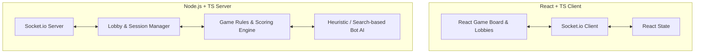

# Kingdoms Board Game

A web-based, real-time multiplayer and solo-play implementation of Reiner Knizia's classic board game **Kingdoms** (originally published as *Auf Heller und Pfennig*). 

This application features a premium dark glassmorphic UI, real-time multiplayer synchronization via WebSockets, automatic scoring calculations with instant visual feedback, and heuristic-based AI bots.

---

## 🌟 Key Features

* **Real-time Multiplayer:** Create or join lobbies with unique room codes. Work together with friends or play against automated AI opponents.
* **Intelligent AI Bots:** Add **Easy** or **Hard** bots to fill empty slots. Bots calculate optimal placements using heuristics and simulate human delays for a natural flow.
* **Auto-Scoring Engine:** The game handles all complex calculations, including special tiles (Dragon, Mountain, Gold Mine, and Wizards) and castle multipliers.
* **Live Board Analytics:** Dynamic margin indicators show the current value of each row and column segment, letting players plan moves without tedious math.
* **Premium Glassmorphic UI:** A highly polished dark mode interface utilizing modern styling, smooth animations, and responsive layouts.

---

## 🛠️ Tech Stack

* **Frontend:** React, TypeScript, Vite, Socket.io-client, Lucide Icons, Custom Vanilla CSS.
* **Backend:** Node.js, Express, TypeScript, Socket.io, ts-node-dev.

---

## 📐 Architecture & System Flow



### WebSocket Events

| Event Name | Direction | Payload | Description |
| :--- | :--- | :--- | :--- |
| `create_game` | Client -> Server | `{ playerName: string, botCount: number }` | Creates a new game lobby. |
| `join_game` | Client -> Server | `{ gameId: string, playerName: string }` | Joins an existing game lobby. |
| `game_state` | Server -> Client | `GameState` (Complete state, hiding other players' secret tiles) | Emitted when state changes. |
| `place_castle` | Client -> Server | `{ castleRank: number, row: number, col: number }` | Places a castle on the grid. |
| `place_secret_tile` | Client -> Server | `{ row: number, col: number }` | Places the player's secret tile. |
| `draw_and_place_tile` | Client -> Server | `{ row: number, col: number }` | Draws and places a tile on the grid. |

---

## 📂 Project Structure

```
/
├── backend/
│   ├── src/
│   │   ├── types.ts      # Shared type definitions
│   │   ├── game.ts       # Board game logic & scoring calculations
│   │   ├── bot.ts        # AI decision-making & heuristics
│   │   └── server.ts     # Socket.io handlers & Express server
│   ├── package.json
│   └── tsconfig.json
│
├── frontend/
│   ├── src/
│   │   ├── components/
│   │   │   ├── Lobby.tsx       # Room creation, joining, and bot config
│   │   │   └── GameBoard.tsx   # Interactive grid, player deck, logs, and scoreboards
│   │   ├── App.tsx             # Main coordinator and Socket connection
│   │   ├── index.css           # Global theme, animations, and custom styling
│   │   ├── main.tsx            # Entry point
│   │   └── types.ts            # Client-side type definitions
│   ├── index.html
│   ├── vite.config.ts
│   └── package.json
│
├── docs/                 # Additional developer documentation
├── start backend.bat     # Windows batch script to run the backend dev server
└── start frontend.bat    # Windows batch script to run the frontend dev server
```

---

## 🚀 Setup & Local Development

### Prerequisites

* [Node.js](https://nodejs.org/) (v18 or higher recommended)
* npm (comes with Node.js)

### Running with Scripts (Windows)

Double-click the following files in the project root:
1. `start backend.bat` — Launches backend server on port `3001`
2. `start frontend.bat` — Launches frontend dev server on `http://localhost:5174/`

### Manual Startup

#### 1. Start the Backend
```bash
cd backend
npm install
npm run dev
```

#### 2. Start the Frontend
```bash
cd frontend
npm install
npm run dev
```
Open `http://localhost:5174/` in your browser.

---

## 🎲 Game Rules Summary

* **Objective:** Amass the most gold over **three epochs (rounds)**.
* **Actions:** On your turn, you must either:
  1. Draw a random tile from the bag and place it on the board.
  2. Place your face-down "secret" tile (and draw a replacement).
  3. Place one of your available castles on the board.
* **Scoring:** When the grid is full, each row and column is scored. Castles multiply the line's net value by their rank (1-4).
* **Special Tiles:**
  * **Dragon:** Negates all positive resource tiles in its row & column.
  * **Mountain:** Splits its row/column into two independent scoring segments.
  * **Gold Mine:** Doubles the score of its row and column.
  * **Wizard:** Increases the rank of all adjacent castles by $+1$.
* **Rounds:** At the end of an epoch, Rank 1 castles return to your pool, while Ranks 2, 3, and 4 are permanently discarded.
